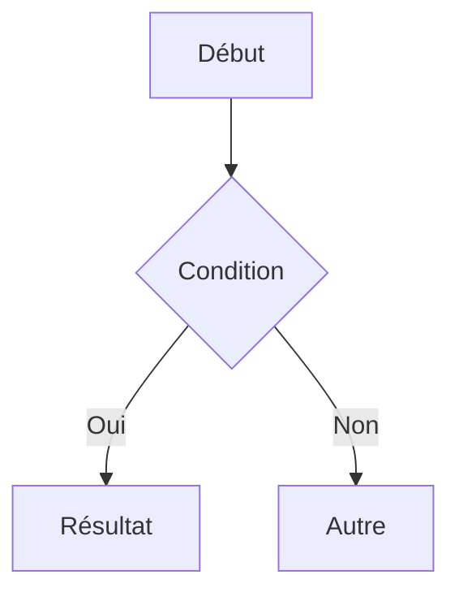

# md2moodle

Convertisseur **Markdown → cours interactif HTML/PDF** pour Moodle (et au-delà).  
Gère les slides (Reveal.js), les formules (KaTeX), les diagrammes (Mermaid), la coloration syntaxique (highlight.js) et les exports PDF via Puppeteer.

---

## Installation globale

```bash
# Cloner ou télécharger le projet
git clone https://github.com/votre-repo/md2moodle.git
cd md2moodle

# Installer les dépendances + télécharger les librairies runtime
npm install
node scripts/fetch-libs.js

# Rendre la commande disponible globalement
npm link
```

Vérifier que ça fonctionne :

```bash
md2moodle --version
```

---

## Utilisation

### Cours HTML pour Moodle

```bash
# Page unique
md2moodle --type html cours.md

# Multi-pages avec sommaire
md2moodle --type html --index matplotlib.md --summary summary.md

# Avec thème
md2moodle --type html --theme dark cours.md --output ./dist
```

Produit un `.zip` déposable directement dans Moodle (ressource Fichier).

### Export PDF cours

```bash
md2moodle --type pdf cours.md
```

Produit `cours.pdf` — propre, avec en-tête/pied de page, KaTeX rendu, Mermaid rendu.

### Export PDF examen

```bash
md2moodle --type examen examen.md
```

Produit `examen-examen.pdf` avec en-tête étudiant, QCM, espaces de réponse.

### Serveur de développement (live-reload)

```bash
md2moodle --type serve cours.md
# Ouvre http://localhost:3737 et recharge à chaque modification
```

---

## Structure d'un cours Markdown

```markdown
---
title: "Introduction à Python"
subtitle: "CBIO1 — 2024-2025"
author: "Prénom NOM"
theme: dark
---

# Introduction à Python

Présentation du cours.

---

## Variables et types

Texte du cours.

```python
x = 42  # [hl]  ← cette ligne sera surlignée
print(x)
```

---

## Formules

Inline : $E = mc^2$

Bloc :

$$\int_0^\infty e^{-x^2} dx = \frac{\sqrt{\pi}}{2}$$

---

## Diagramme



---

## Callouts

<div class="callout callout-info">
Info utile.
</div>

<div class="callout callout-warning">
Attention.
</div>


---

## Structure d'un examen Markdown

```markdown
---
title: "Examen — Algorithmique"
subtitle: "CBIO1 — 2024-2025"
date: "15 janvier 2025"
duree: "2h"
documents: "Aucun document autorisé"
etablissement: "ISEN Yncréa Ouest"
---

## Partie 1 — Python *(8 points)*

### Question 1 *(2 pts)*

Quelle est la complexité de cet algorithme ?

- [ ] O(1)
- [ ] O(n)
- [x] O(n²)  ← réponse correcte (masquer avant impression)
- [ ] O(log n)

### Question 2 *(3 pts)*

Expliquez le rôle des décorateurs Python.

::: reponse 6
:::

### Question 3 *(3 pts)*

Écrivez une fonction qui calcule la suite de Fibonacci.

::: reponse 10
:::
```

---

## Fichier sommaire (multi-pages)

```markdown
# Python — Cours complet

## Fondamentaux
- [Introduction](intro.md)
- [Variables et types](variables.md)
- [Structures de contrôle](controle.md)

## Avancé
- [Fonctions](fonctions.md)
- [Classes et objets](classes.md)
```

---

## Thèmes

| Thème     | Description                          |
|-----------|--------------------------------------|
| `default` | Bleu, épuré, DM Sans                |
| `dark`    | Fond sombre, accents bleus           |
| `minimal` | Noir et blanc, idéal pour TD imprimé |

Créer un thème custom :

```css
/* themes/montheme.css */
@import url('./default.css');

:root {
  --color-accent:       #c0392b;   /* rouge ISEN */
  --color-accent-light: #fde8e6;
  --font-body: 'Source Sans 3', sans-serif;
}
```

```bash
md2moodle --theme montheme cours.md
```

---

## Structure du projet

```
md2moodle/
├── src/
│   ├── cli/
│   │   └── index.js          ← point d'entrée CLI
│   ├── builders/
│   │   ├── html.js           ← export HTML (.zip Moodle)
│   │   ├── pdf.js            ← export PDF cours (Puppeteer)
│   │   ├── examen.js         ← export PDF examen
│   │   └── serve.js          ← serveur dev live-reload
│   ├── utils/
│   │   ├── markdown.js       ← parsing MD + frontmatter
│   │   ├── assets.js         ← résolution/copie des assets
│   │   ├── template.js       ← génération HTML
│   │   ├── runtime.js        ← résolution des chemins runtime
│   │   └── log.js            ← logger coloré
│   └── plugins/              ← (extensible)
│       └── README.md
├── runtime/
│   ├── moteur.js             ← moteur JS côté navigateur
│   ├── print.css             ← styles impression PDF cours
│   ├── exam.css              ← styles impression PDF examen
│   ├── themes/
│   │   ├── default.css
│   │   ├── dark.css
│   │   └── minimal.css
│   └── libs/                 ← librairies JS/CSS (fetch-libs.js)
├── scripts/
│   ├── fetch-libs.js         ← télécharger les librairies
│   └── install-global.js     ← assistant installation
└── package.json
```

---

## Raccourcis clavier (mode navigateur)

| Touche | Action               |
|--------|----------------------|
| `S`    | Basculer slides/doc  |
| `F`    | Plein écran          |
| `P`    | Exporter PDF (print) |

---

## Librairies utilisées

- **marked.js** — rendu Markdown
- **highlight.js** — coloration syntaxique
- **KaTeX** — formules mathématiques LaTeX
- **Mermaid** — diagrammes
- **Reveal.js** — présentations slides
- **Puppeteer** — export PDF haute qualité
- **gray-matter** — frontmatter YAML
- **chokidar** — surveillance de fichiers

---

## Prévisualisation live et intégration VSCode

### Démarrer le serveur de prévisualisation

```bash
# Ouvre http://localhost:3737 dans votre navigateur par défaut
md2moodle --type serve cours.md

# Port custom
md2moodle --type serve cours.md --port 8080

# Ouvre directement dans le panneau Simple Browser de VSCode
md2moodle --type serve cours.md --vscode

# Sans ouvrir le navigateur (si vous voulez le faire manuellement)
md2moodle --type serve cours.md --no-open
```

Le serveur surveille automatiquement :
- Le fichier Markdown principal
- Tous les assets du dossier (images, etc.)
- Le fichier CSS du thème

**Rechargement :** dès que vous sauvegardez (`Ctrl+S`), la page se recharge en ~100ms.  
Une barre verte flash en haut de la page confirme chaque rechargement.

### Workflow recommandé dans VSCode

**Option A : Simple Browser intégré (sans extension)**

```bash
md2moodle --type serve cours.md --vscode
```

Cela ouvre automatiquement `http://localhost:3737` dans un panneau VSCode à côté de votre éditeur.  
Disposition typique : éditeur à gauche, prévisualisation à droite.

**Option B : Via les tâches VSCode (raccourci clavier)**

Le projet inclut `.vscode/tasks.json`. Pour l'utiliser :
1. Ouvrez le dossier du projet dans VSCode
2. `Ctrl+Shift+P` → `Tasks: Run Task`
3. Choisissez `md2moodle: serve (VSCode Simple Browser)`

Ou assignez un raccourci dans `keybindings.json` :

```json
{
  "key": "ctrl+shift+p",
  "command": "workbench.action.tasks.runTask",
  "args": "md2moodle: serve (VSCode Simple Browser)"
}
```

**Option C : Terminal intégré VSCode**

Ouvrez le terminal intégré (`Ctrl+\``) et lancez :

```bash
md2moodle --type serve cours.md
```

Puis `Ctrl+Shift+P` → `Simple Browser: Show` → entrez `http://localhost:3737`.

### Vitesse de la boucle édition → prévisualisation

| Action                      | Délai ressenti   |
|-----------------------------|-----------------|
| Sauvegarde fichier `.md`    | ~80–150 ms      |
| Rechargement navigateur     | ~200–400 ms     |
| Total (save → vue à jour)   | **< 500 ms**    |

Le rendu Markdown + KaTeX + Mermaid se fait côté navigateur, donc la latence est
quasi-nulle une fois la page chargée. Seul le rechargement de page ajoute un délai.

> **Note sur Mermaid :** les diagrammes complexes peuvent prendre 300–600 ms à rendre
> côté client. C'est une contrainte de la librairie, pas du serveur.

