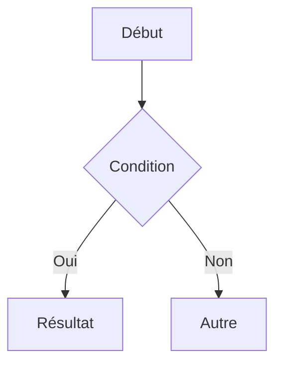
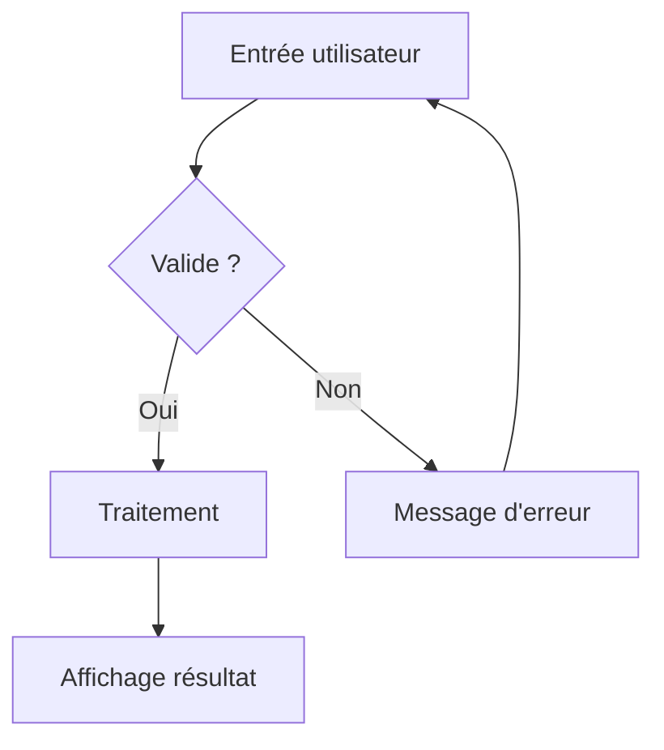

# Introduction à Python

Sous-titre — CBIO1

---

## Pourquoi Python ?

Python est un langage de programmation **interprété**, **dynamiquement typé** et
conçu pour la lisibilité du code.

> "Code is read more often than it is written." — Guido van Rossum

<div class="callout callout-info">
Python est le langage le plus utilisé en data science, IA et automatisation.
</div>

---

## Variables et types

```python
# Types de base
x      = 42          # int    [hl]
pi     = 3.14        # float
nom    = "Alice"     # str
actif  = True        # bool
rien   = None        # NoneType

print(type(x))       # <class 'int'>
```

| Type    | Exemple      | Mutable |
|---------|-------------|---------|
| `int`   | `42`        | Non     |
| `float` | `3.14`      | Non     |
| `str`   | `"hello"`   | Non     |
| `list`  | `[1, 2, 3]` | **Oui** |
| `dict`  | `{"a": 1}`  | **Oui** |


---

## Test


<a href="https://docs.python.org/3/"> Python doc </a>


> [!info] Here's a callout title
> Here's a callout block.
> It supports **Markdown**


> [!question] Can callouts be nested? 
>> [!question] Yes!, they can.
>>> [!question]  You can even use multiple layers of nesting.


---




---

## Callouts


> Callout test
>   
> bla


> [!info] Here's a callout title
> Here's a callout block.
> It supports **Markdown**


> [!warning] Here's a callout title
> Here's a callout block.
> It supports **Markdown**


> [!danger] Here's a callout title
> Here's a callout block.
> It supports **Markdown**


> [!success] Here's a callout title
> Here's a callout block.
> It supports **Markdown**


---

## Formules

Complexité linéaire : $O(n)$

Formule de la somme :

$$S_n = \sum_{k=1}^{n} k = \frac{n(n+1)}{2}$$

---

## Diagramme de flux



---

## Exercice

<div class="callout callout-warning">
Écrire une fonction `fibonacci(n)` qui retourne le n-ième terme.
</div>

```python
def fibonacci(n):
    if n <= 1:
        return n
    return fibonacci(n - 1) + fibonacci(n - 2)

# Test
for i in range(10):
    print(fibonacci(i), end=' ')
# 0 1 1 2 3 5 8 13 21 34
```

<div class="callout callout-success">
Complexité : $O(2^n)$ récursif → optimisable en $O(n)$ avec la mémoïsation.
</div>
